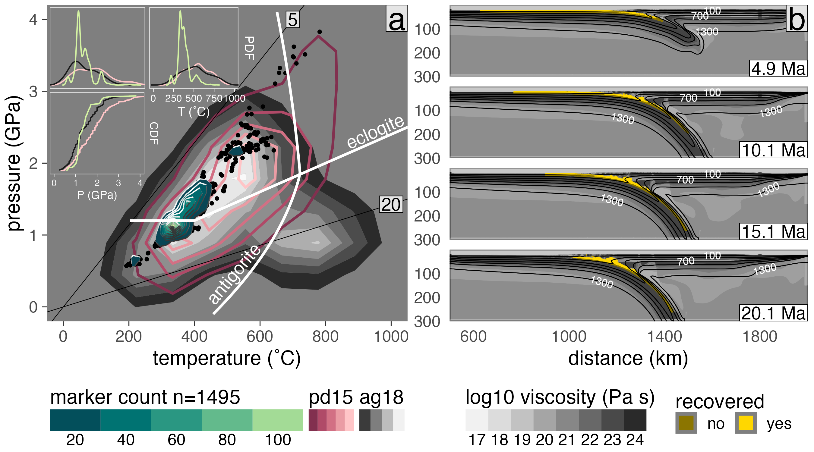

***Figure:*** *Summary of marker recovery for model cda62. (a) Pressure-temperature diagram showing the frequency of recovered markers (black points and green Tanaka contours) in comparison with the pd15 (solid red contours) and ag18 (filled gray contours) data sets. Thin lines are thermal gradients labeled in °C/km. Reaction boundaries for eclogitization of oceanic crust and antigorite dehydration are from Ito and Kennedy ([1971](https://agupubs.onlinelibrary.wiley.com/action/getFTRLinkout?url=http%3A%2F%2Fscholar.google.com%2Fscholar_lookup%3Fhl%3Den%26volume%3D14%26publication_year%3D1971%26pages%3D303-314%26journal%3DThe%2BStructure%2Band%2BPhysical%2BProperties%2Bof%2Bthe%2BEarth%25E2%2580%2599s%2BCrust%26issue%3D%2500null%2500%26issn%3D%2500null%2500%26author%3DK.%2BIto%26author%3DG.%2BKennedy%26title%3DAn%2Bexperimental%2Bstudy%2Bof%2Bthe%2Bbasalt%25E2%2580%2590garnet%2Bgranulite%25E2%2580%2590eclogite%2Btransition%26pmid%3D%2500empty%2500%26doi%3D%2500null%2500&doi=10.1029%2F2022GC010834&linkType=gs&linkLocation=Reference&linkSource=FULL_TEXT)) and Schmidt and Poli ([1998](https://doi.org/10.1016/s0012-821x(98)00142-3)), respectively. Marker counts (Tanaka contours) are computed across a 100 × 100 grid (0.04 GPa × 10°C). (insets) Probability distribution functions (top insets) and cumulative distribution functions (bottom inset) comparing P and T distributions between numerical experiments (green lines) and natural samples (pink lines: pd15, black lines: ag18). (b) Visualization of log viscosity in the model domain showing the major modes of marker recovery along a relatively thick subduction interface that tapers near the viscous coupling depth.*

# Kerswell et al. (2023; G3)

This work investigates where, and how many, rocks get detached from subducting oceanic plates beneath convergent margins. Over one-million numerical markers (representing rock fragments) from 64 numerical experiments were traced and classified as recovered, or not recovered, using a bespoke classification algorithm we wrote. Our results indicate that rocks are recovered from discrete depths, rather than continuously along the subduction interface.

The [manuscript](https://agupubs.onlinelibrary.wiley.com/doi/abs/10.1029/2022GC010834) was published in *Geochemistry, Geophysics, Geosystems* on May 18, 2023. You can find the article [here](https://buchanankerswell.com/assets/pdf/kerswell-et-al-marx-g3-2023.pdf).

This repository provides all materials for the manuscript *Computing Rates and Distributions of Rock Recovery in Subduction Zones* (Kerswell et al., 2023; G3). You can find the article [here](https://agupubs.onlinelibrary.wiley.com/doi/full/10.1029/2022GC010834).

## Repository

This repository includes:

- An R script to download all data required to compile the study
- R scripts to run the analyses and reproduce all results and figures
- A Makefile and run.sh script to easily compile the study
- The complete manuscript written in Rmarkdown

This repository is self-contained but requires the following software (all open-source).

## Prerequisite software

### R

This study is written in R. Follow the instructions at [R's homepage](https://www.r-project.org) to download and install the latest release of R on your machine.

## Running the study

```
# Clone this repository
git clone https://github.com/buchanankerswell/kerswell_et_al_marx.git

# Change into the directory
cd kerswell_et_al_marx

# Use Makefile to compile
make
```

This will check for required R packages and try to install missing packages automatically.

If all packages are found and available it will proceed to run the study with some initial prompts from the user. The study takes about 2.5-3hr to run on my MacBook Air (M1 8GB, 2020) with 8 cores computing in parallel and 20 jackknife samples. The study takes about 7 minutes to run without resampling.

## Coauthors:

 - [Matthew Kohn](https://www.google.com/url?sa=t&rct=j&q=&esrc=s&source=web&cd=&cad=rja&uact=8&ved=2ahUKEwj8yqqTw8T5AhWSADQIHaYXAfQQFnoECA4QAQ&url=https%3A%2F%2Fwww.boisestate.edu%2Fearth%2Fstaff-members%2Fmatthew-j-kohn%2F&usg=AOvVaw3-lM9gvqmVRHG-WhSRFOdu) (Boise State University)
 - [Taras Gerya](https://www.google.com/url?sa=t&rct=j&q=&esrc=s&source=web&cd=&cad=rja&uact=8&ved=2ahUKEwjI1eiYw8T5AhViLzQIHdZJDT4QFnoECBMQAQ&url=https%3A%2F%2Ferdw.ethz.ch%2Fen%2Fpeople%2Fprofile.taras-gerya.html&usg=AOvVaw1ZWpP5eVNtfgnNmrhmGcGJ) (ETH Zürich)

## Acknowledgement

We gratefully acknowledge high-performance computing support from the Borah compute cluster ([https://doi.org/10.18122/oit/3/boisestate](https://doi.org/10.18122/oit/3/boisestate)) provided by Boise State University's Research Computing Department. We thank two anonymous reviewers who provided thoughtful feedback that greatly improved the manuscript. We also thank Whitney Behr for her editorial handling. This work was supported by the National Science Foundation Grant OISE 1545903 to M. Kohn, S. Penniston-Dorland, and M. Feineman.

## Open Research

All data, code, and relevant information for reproducing this work can be found at [https://github.com/buchanankerswell/kerswell_et_al_marx](https://github.com/buchanankerswell/kerswell_et_al_marx), and at [https://doi.org/10.17605/OSF.IO/3EMWF](https://doi.org/10.17605/OSF.IO/3EMWF), the official Open Science Framework data repository ([Kerswell et al., 2023](https://doi.org/10.17605/OSF.IO/3EMWF)). All code is MIT Licensed and free for use and distribution (see license details).

## Abstract:

Bodies of rock that are detached (recovered) from subducting oceanic plates, and exhumed to Earth's surface, become invaluable records of the mechanical and chemical processing of rock along subduction interfaces. Exposures of interface rocks with high-pressure (HP) mineral assemblages provide insights into the nature of rock recovery, yet various inconsistencies arise when directly comparing the rock record with numerical simulations of subduction. Constraining recovery rates and depths from the rock record presents a major challenge because small sample sizes of HP rocks reduce statistical power. As an alternative approach, this study implements a classification algorithm to identify rock recovery in numerical simulations of oceanic-continental convergence. Over one million markers are classified from 64 simulations representing a large range of subduction zones. Recovery pressures (depths) correlate strongly with convergence velocity and moderately with oceanic plate age, while slab-top thermal gradients correlate strongly with oceanic plate age and upper-plate thickness. Recovery rates strongly correlate with upper-plate thickness, yet show no correlation with convergence velocity or oceanic plate age. Likewise, pressure-temperature (PT) distributions of recovered markers vary among numerical experiments and generally show deviations from the rock record that cannot be explained by petrologic uncertainties alone. For example, a significant gap in marker recovery is found near 2 GPa and 550°C, coinciding with the highest frequencies of exhumed HP rocks. Explanations for such a gap in marker recovery include numerical modeling uncertainties, selective sampling of exhumed HP rocks, or natural geodynamic factors not accounted for in numerical experiments.

## License

MIT License

Copyright (c) 2021 Buchanan Kerswell

Permission is hereby granted, free of charge, to any person obtaining a copy
of this software and associated documentation files (the "Software"), to deal
in the Software without restriction, including without limitation the rights
to use, copy, modify, merge, publish, distribute, sublicense, and/or sell
copies of the Software, and to permit persons to whom the Software is
furnished to do so, subject to the following conditions:

The above copyright notice and this permission notice shall be included in all
copies or substantial portions of the Software.

THE SOFTWARE IS PROVIDED "AS IS", WITHOUT WARRANTY OF ANY KIND, EXPRESS OR
IMPLIED, INCLUDING BUT NOT LIMITED TO THE WARRANTIES OF MERCHANTABILITY,
FITNESS FOR A PARTICULAR PURPOSE AND NONINFRINGEMENT. IN NO EVENT SHALL THE
AUTHORS OR COPYRIGHT HOLDERS BE LIABLE FOR ANY CLAIM, DAMAGES OR OTHER
LIABILITY, WHETHER IN AN ACTION OF CONTRACT, TORT OR OTHERWISE, ARISING FROM,
OUT OF OR IN CONNECTION WITH THE SOFTWARE OR THE USE OR OTHER DEALINGS IN THE
SOFTWARE.
